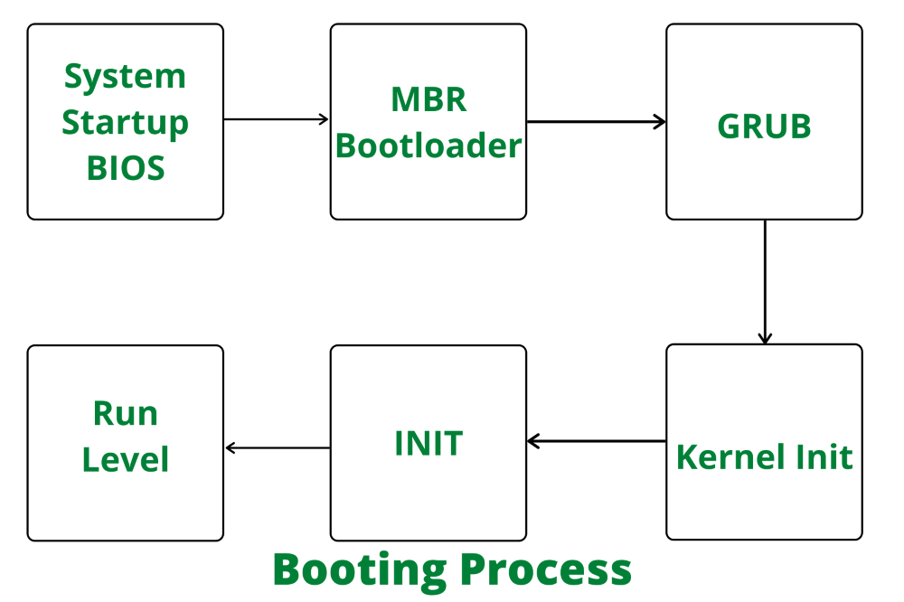

## Linux operating system

#### Fun fact!!! :scream_cat:
- In Linux, everything is considered a file: programs, regular files, directories, block devices (hard disks, etc.), character devices (consoles, etc.), kernel processes, sockets, partitions, links, etc.
- This operating system is developed with the architecture as the same as Unix, but free! :moneybag:

#### Boot process 
<p align="center">
    
</p>

- Step 1: User switchs the power ON. It supplies electricity to the main components like processor, RAM, hard disk...
- Step 2: BIOS program stored in ROM is copied into processor.
- Step 3: BIOS load os kernel program from several first sectors in hard disk to RAM.
- Step 4: Kernel init
- Step 5: Computer asigns a permission to OS.

#### File tree
```
.
├── bin -> usr/bin
├── boot: includes kernel
├── cdrom
├── dev: includes external devices. Each device exists in the form of file.
├── etc
├── home: for user data
├── lib -> usr/lib
├── lib32 -> usr/lib32
├── lib64 -> usr/lib64
├── libx32 -> usr/libx32
├── lost+found
├── media
├── mnt: mount file in here
├── opt
├── proc
├── root
├── run
├── sbin -> usr/sbin
├── snap
├── srv
├── sys
├── tmp
├── usr
└── var
``
#### Process
Is `a file` generating when a programme is loaded in RAM. Each process have its own memory, id, metadata.  
#### Threading
Each process has a main thread and other threads if the programme is processed in multithreading manner. Threads used the same memory (exclude stack memory). The time to create thread is smaller than process because the system just need to allocate stack memory for a new thread. But the problem when working with threads is incompatible shared memory (race condition).
#### Race condition
happens when multi threads write to the same memory resource. For example when running the following programme:
```
#include <stdio.h>
#include <stdlib.h>
#include <pthread.h>

int global_var;

void* increase_by_one() {
	for(int i = 0; i < 1000000; ++i)
		global_var++;
}

int main() {
	pthread_t thread1, thread2;
	int iret1, iret2;
	
	/* Create 2 threads */
	iret1 = pthread_create(&thread1, NULL, increase_by_one, NULL);
	iret2 = pthread_create(&thread2, NULL, increase_by_one, NULL);

	pthread_join(thread1, NULL);
	pthread_join(thread2, NULL);

	printf("Final value of global variable is: %d", global_var);

	return 0;
}
```
The output is: ```Final value of global variable is: 1034360```

When dealing with `x++`, there are 2 steps:
- Move `x+1` to register A (1)
- Move content of register A to `&x` (2)

For multithreading, 2 steps are processed discontinuely. For example, the order could be: thread1(1) -> thread2(1) -> thread1(2) -> thread2(2). So, the output after running 2 thread is still `x+1`, but the expected value is `x+2`. Dangerous :sos: 
#### Mutex
Mutex is used to protect shared memory. This assure that the first thread is processed completely before the second process can work. The correct code for the previous programme:
```
#include <stdio.h>
#include <stdlib.h>
#include <pthread.h>
#include <time.h>

int global_var;
pthread_mutex_t mutex = PTHREAD_MUTEX_INITIALIZER;

void* increase_by_one() {
	for(int i = 0; i < 1000000; ++i) {
		pthread_mutex_lock(&mutex);
		global_var++;
		pthread_mutex_unlock(&mutex);
	}
}

int main() {
	pthread_t thread1, thread2;
	int iret1, iret2;
	clock_t t;
	t = clock();
	
	/* Create 2 threads */
	iret1 = pthread_create(&thread1, NULL, increase_by_one, NULL);
	iret2 = pthread_create(&thread2, NULL, increase_by_one, NULL);

	pthread_join(thread1, NULL);
	pthread_join(thread2, NULL);

	t = clock() - t;

	printf("Final value of global variable is: %d\n", global_var);
	printf("Took %f seconds to execute", ((double)t)/CLOCKS_PER_SEC);

	return 0;
}
``` 